# Azure SIEM & Honeypot SOC Lab

This lab demonstrates hands-on skills in **Azure cloud security monitoring**, **SIEM integration**, and **SOC operations**.

The lab simulates a real-world Security Operations Center (SOC) scenario using honeypots, centralized logging, and security analytics to demonstrate **threat detection**, **log analysis**, and **incident investigation** in Azure.

---

## Lab Overview

- Designed and deployed a **cloud-based SOC lab** in Azure
- Used **honeypot virtual machines** to attract and log malicious activity
- Centralized security logs using **Azure Monitor and Log Analytics**
- Queried and analyzed security events using **KQL (Kusto Query Language)**
- Simulated real-world attack behavior for detection and analysis

**Business Problem Solved:**  
- Provides visibility into malicious activity targeting cloud workloads  
- Demonstrates SOC analyst skills in monitoring, detection, and investigation  
- Shows how organizations detect threats before production systems are impacted  

---

## Resource Group & Environment Setup

- Created a **dedicated resource group** to logically separate SOC resources  
- Organized compute, networking, and monitoring components under one management boundary  
- Enabled easier lifecycle management, visibility, and cost control

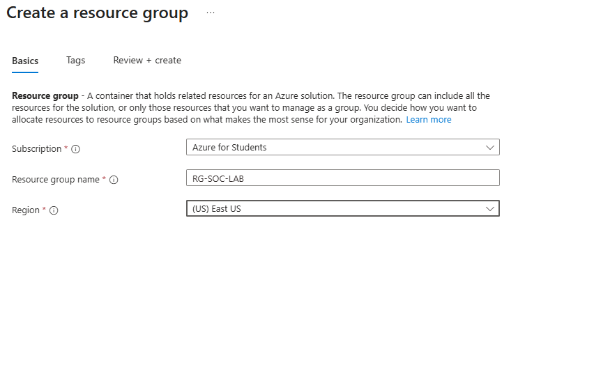  
*Dedicated resource group created to contain all SOC lab resources.*

---

## Virtual Network Configuration

- Created a **Virtual Network (VNet)** to isolate the SOC lab environment  
- Defined address space and subnet for the honeypot VM  
- Provided controlled network segmentation for security monitoring and analysis

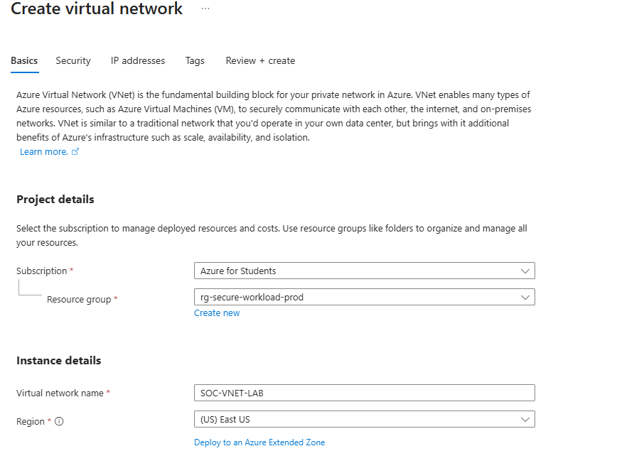  
*Virtual network created to support the honeypot and SOC monitoring architecture.*

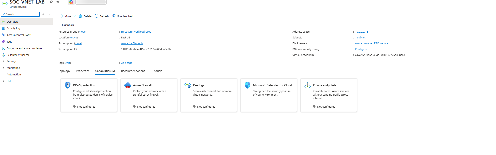  
*Overview of the configured virtual network and subnet.*

---

## Honeypot Deployment

- Deployed **Azure Virtual Machines** configured as honeypots  
- Attached the VM to the previously created **VNet and subnet**  
- Configured **Network Security Groups (NSGs)** to allow controlled inbound traffic  
- Generated security events using RDP access, ICMP traffic, and failed authentication attempts

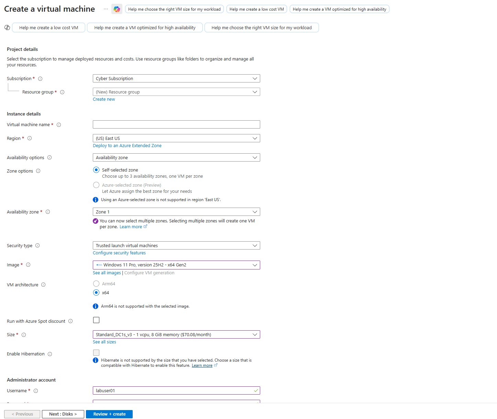  
*Provisioning a Windows VM to act as a honeypot.*

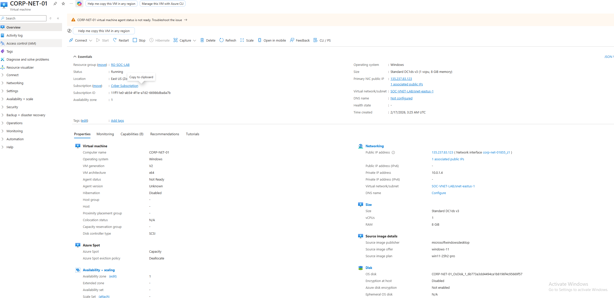  
*Overview of the deployed honeypot virtual machine.*

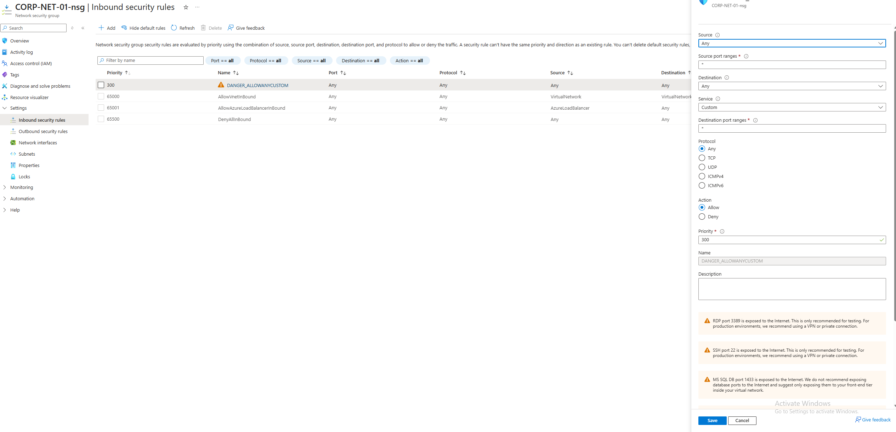  
*Inbound NSG rules allowing controlled traffic to the honeypot.*

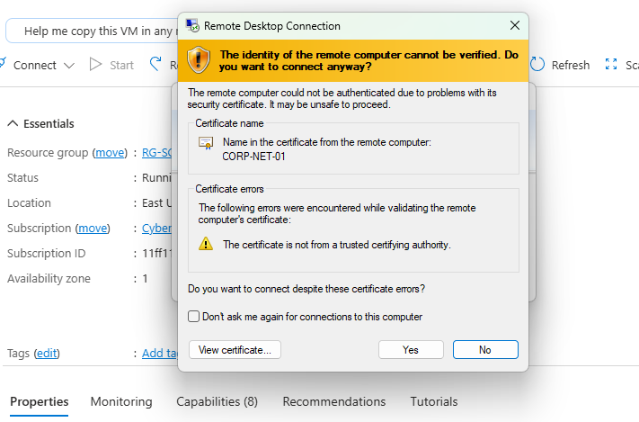  
*RDP access into the honeypot VM.*

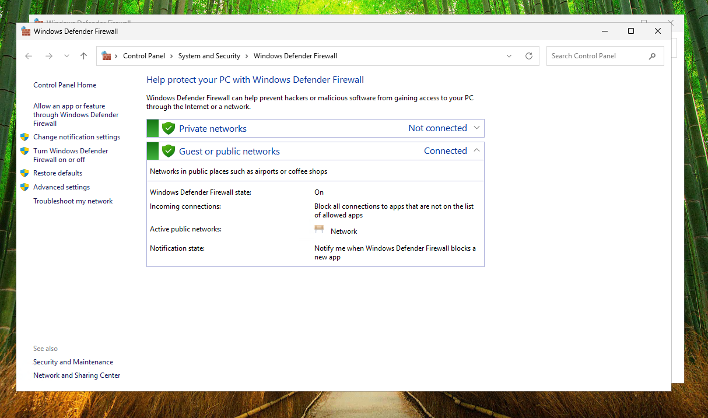  
*Firewall temporarily disabled to allow traffic for logging purposes.*

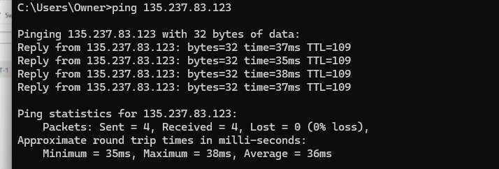  
*Connectivity test generating network traffic.*

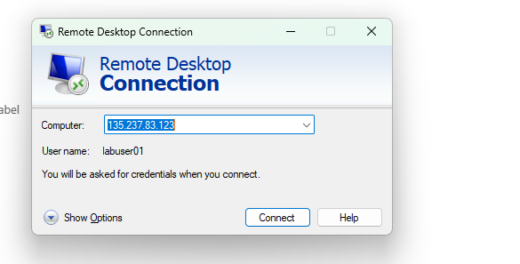  
*Simulated failed login attempts to generate security events.*

---

## Log Collection & Monitoring

- Created a **Log Analytics Workspace** for centralized security logging  
- Enabled **Windows Security Events** collection via **Azure Monitor Agent (AMA)**  
- Configured **Data Collection Rules (DCRs)** to ingest relevant security logs

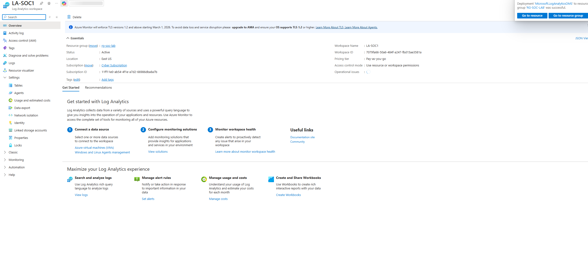  
*Log Analytics workspace receiving security event data.*

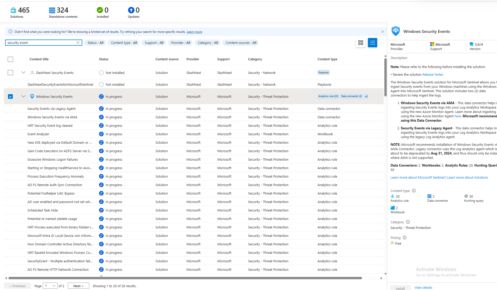  
*Windows Security Events enabled for SOC monitoring.*

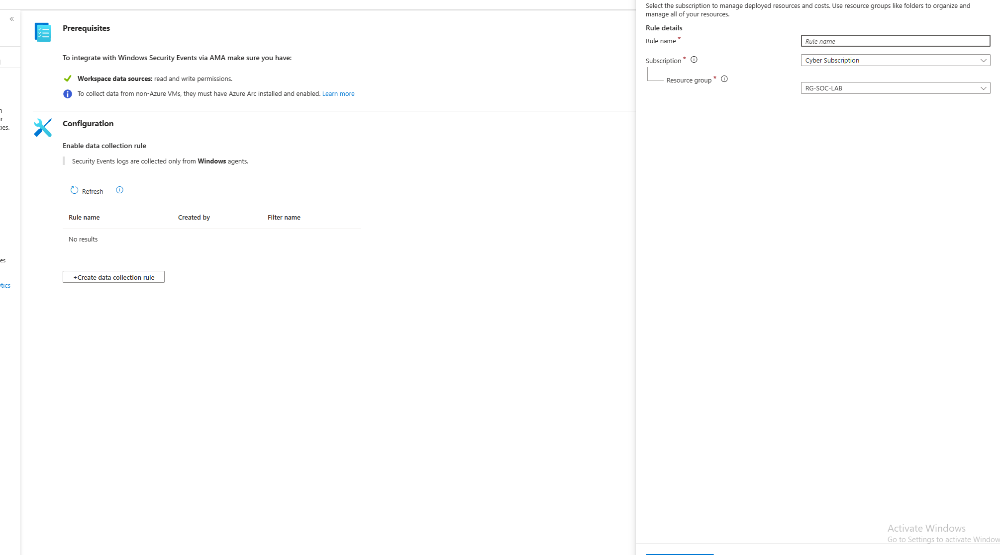  
*Data Collection Rule defining which security events are collected.*

  
*Azure Monitor Agent installed on the honeypot VM.*

---

## Security Event Queries & Threat Analysis

- Queried security logs using **KQL (Kusto Query Language)**  
- Identified **failed logins**, suspicious IP addresses, and malicious behavior  
- Demonstrated SOC-style investigation and threat analysis workflows

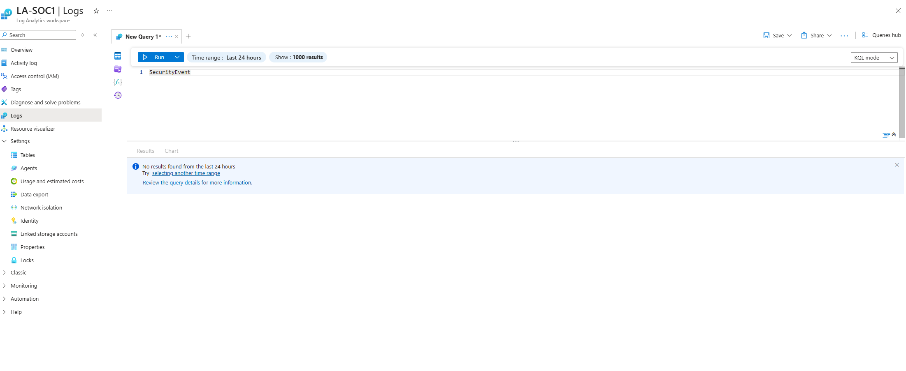  
*KQL query used to analyze Windows Security Event logs.*

  
*Captured logs showing malicious activity targeting the honeypot.*

---

## Platforms & Technologies Used

Azure Virtual Machines, Azure Virtual Networks, Network Security Groups (NSGs), Azure Log Analytics, Azure Monitor Agent, Data Collection Rules, KQL, Windows Security Events, Simulated Attack Traffic, GitHub

---

## Summary

This lab demonstrates **end-to-end SOC monitoring and threat detection in Azure**, including:

- Secure **environment planning and resource organization**
- **Honeypot deployment** for attack simulation
- Centralized **log ingestion and analysis**
- Practical **SOC investigation, detection, and response workflows**
